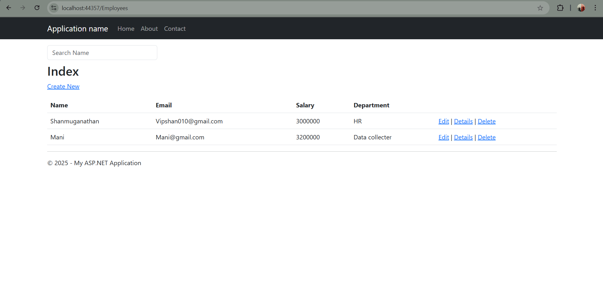
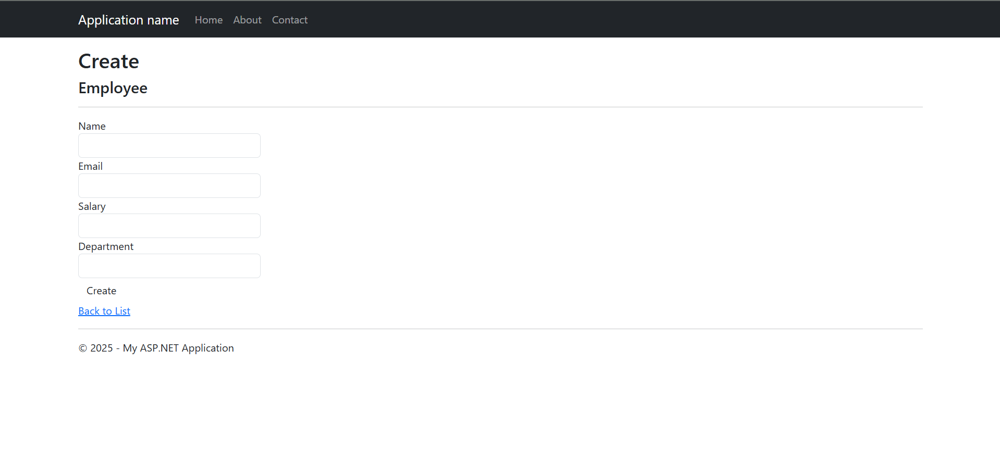

# Employee CRUD Application — ASP.NET MVC + Entity Framework + SQL Server

A complete Employee Management System built using **ASP.NET MVC 5**, **Entity Framework 6**, and **SQL Server**.  
This project demonstrates CRUD operations, strong MVC architecture, and Database-First approach — perfect for interviews and portfolio.

---

## 🚀 Features

- ➕ Add New Employee  
- ✏️ Edit Employee  
- ❌ Delete Employee  
- 📄 View Employee List  
- 🔍 Search Employee by Name  
- 🎨 Clean, responsive UI using Bootstrap  

---

## 🛠️ Tech Stack

| Layer        | Technology                   |
|--------------|------------------------------|
| Frontend/UI  | HTML5, CSS3, Bootstrap       |
| Backend      | ASP.NET MVC 5                |
| ORM          | Entity Framework 6 (DB-First)|
| Database     | SQL Server                   |
| Language     | C#                           |

---

## 📁 Project Structure

/Controllers
EmployeesController.cs
/Models
EmployeeDBModel.edmx
Employee.cs
/Views
/Employees
Index.cshtml
Create.cshtml
Edit.cshtml
Delete.cshtml
Details.cshtml


---

## 💻 How to Run This Project

### ✔ Prerequisites
- Visual Studio (2019/2022 recommended)
- SQL Server / SQL Server Express
- .NET Framework (4.x)

### ✔ Setup Steps
1. Clone the repository:  
   ```bash
   git clone https://github.com/Shan-0106/EmployeeCRUD-MVC.git

2. Open the .sln file in Visual Studio
   
3. Create the database in SQL Server:
   CREATE DATABASE EmployeeDB;

USE EmployeeDB;

CREATE TABLE Employees(
    Id INT IDENTITY(1,1) PRIMARY KEY,
    Name VARCHAR(100),
    Email VARCHAR(100),
    Salary DECIMAL(10,2),
    Department VARCHAR(50)
);

4. Update Web.config connection string (if needed)

5. Build the solution → Rebuild

6. Run the project (Ctrl + F5)

7. Go to the URL: Add
   /Employees


### Screenshot — Home Page  


### Screenshot — Employee List Page  

